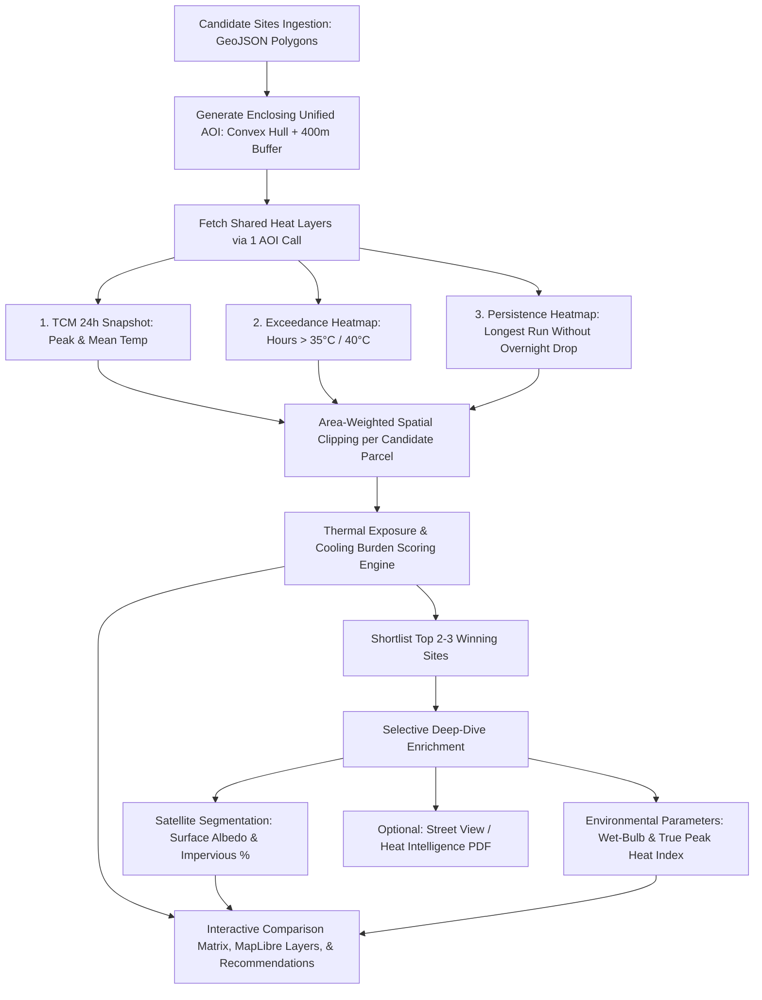

# FortyGuard Temperature API Technical Reconnaissance

**Project:** Thermal Capital — FortyGuard Hackathon 2026  
**Track:** Track 1: Resilient Cities & Infrastructure  
**Target Customer:** Municipal Governments & Urban Heat Planners  
**Target Geography:** New York City (All 5 Boroughs)  
**Date:** 2026-08-18  

---

## 1. Executive Summary

This document captures the technical reconnaissance of the FortyGuard Temperature API Quickstart codebase (`FortyGuard-Tech/temperature-api-quickstart`). It defines the exact API contract, response schemas, reusable client code, key physical and architectural limitations, and the data pipeline design for the **Thermal Capital** application.

---

## 2. Endpoint Inventory

The official client (`fortyguard.FortyGuardClient`) provides programmatic access to the FortyGuard tOS Enterprise API (`https://api.fortyguard.com`). All analysis endpoints follow an **asynchronous submit-and-poll** model where the client submits a task (`POST /v1/<endpoint>`), receives an `activity_id`, and polls `GET /v1/status/{activity_id}` until completion.

| # | Endpoint Method | HTTP Route | Plan Tier | Primary Purpose / Notes |
|---|----------------|------------|-----------|-------------------------|
| 1 | `client.create_heatmap(...)` | `POST /v1/heatmap` | Basic / Premium | Generates 2-metre ambient thermal grid (`60m`, `80m`, `100m`) over a polygon AOI. Supports snapshot (`tcm`) and derived analysis heatmaps (`time_of_measure`, `exceedance`, `persistence`). |
| 2 | `client.environmental_parameters(...)` | `POST /v1/env_params` | Basic / Premium | Returns point-level diurnal time-series (heat index, apparent temp, wet-bulb, RH, AQI, solar irradiance). Requires a `temperature` (°C) anchor. |
| 3 | `client.satellite_segmentation(...)` | `POST /v1/satellite` | Premium | Land-cover classification (building, pavement, tree canopy, soil, vegetation) at a tile around a point coordinate. Returns class coverage % and base64 imagery. |
| 4 | `client.street_view_segmentation(...)` | `POST /v1/streetview` | Premium | Ground-level panoramic image segmentation (sky openness, building walls, eye-level shade, road/sidewalk). Configurable pitch/yaw angles. |
| 5 | `client.heat_intelligence(...)` | `POST /v1/heat_intelligence` | Premium | Multi-dimensional heat risk and mitigation report. Downloads a pre-signed PDF covering geographic, environmental, urban, event, and anthropogenic factors. |
| 6 | `client.fetch_api_key_usage()` | `POST /v1/system/fetch-api-key-usage` | All | Returns current billing cycle credit consumption and per-endpoint call breakdown (0 credit cost). |
| 7 | `client.fetch_api_key_custom_usage(...)` | `POST /v1/system/fetch-api-key-custom-usage` | All | Returns credit consumption breakdown across a custom date window (`start_date`, `end_date`). |
| 8 | `client.get_status(activity_id)` | `GET /v1/status/{activity_id}` | All | Checks the lifecycle state (`pending`, `processing`, `completed`/`succeeded`, `failed`/`error`) of an asynchronous task. |
| 9 | `client.wait_for(activity_id, ...)` | Polling helper | All | Blocks until an activity reaches a terminal state, handling transient 404s (`ActivityNotReadyError`). |

---

## 3. Request and Response Schemas

### 3.1 `POST /v1/heatmap`

#### Filter Types (`date_time.filter_type`)
- `1`: Single hour (requires `start_date`, `start_time` `HH:MM`).
- `2`: Range of hours on same day (requires `start_date`, `start_time`, `end_time`).
- `3`: Single day 24-hour aggregate (requires `start_date`; `start_time` ignored).
- `4`: Range of days up to ~31 days (requires `start_date`, `end_date`).

#### TCM Snapshot / Daily Aggregate (`analytic_type="tcm"`)
- **Request Payload:**
  ```json
  {
    "polygon_aoi": {
      "type": "FeatureCollection",
      "features": [
        {
          "type": "Feature",
          "properties": {},
          "geometry": {
            "type": "Polygon",
            "coordinates": [[[-112.12, 33.41], [-112.00, 33.41], [-112.00, 33.52], [-112.12, 33.52], [-112.12, 33.41]]]
          }
        }
      ]
    },
    "date_time": {
      "start_date": "2024-07-15",
      "filter_type": 3
    },
    "granularity": 80,
    "analytic_type": "tcm"
  }
  ```
- **Response Shape (`result`):**
  ```json
  {
    "map_data": {
      "type": "FeatureCollection",
      "features": [
        {
          "id": "0",
          "type": "Feature",
          "properties": {
            "tile_id": 0,
            "average_temperature": 34.82,
            "min_temperature": 26.15,
            "max_temperature": 43.70
          },
          "geometry": {
            "type": "Polygon",
            "coordinates": [[[-112.12, 33.41], [-112.119, 33.41], [-112.119, 33.411], [-112.12, 33.411], [-112.12, 33.41]]]
          }
        }
      ]
    },
    "stats_data": {
      "temperature_stats": {
        "minimum": 33.10,
        "maximum": 36.45,
        "mean": 34.80,
        "standard_deviation": 0.58
      },
      "overall_temperature_distribution": [33.10, 34.20, 34.80, 35.30, 36.45],
      "normal_temperature_distribution": {
        "x_axis": [32.5, 33.0, "..."],
        "y_axis": [0.01, 0.05, "..."]
      },
      "temperature_frequency": {
        "x_axis": [34.0, 35.0],
        "y_axis": [1200, 850]
      }
    }
  }
  ```
  *(Note: For `filter_type=1` or `2`, tile properties contain `properties.temperature` instead of `min`/`max`/`average`.)*

#### Analysis Heatmaps (`analytic_type="exceedance" | "persistence" | "time_of_measure"`)
- **Request Parameters:**
  - `analytic_type`: `"exceedance"` or `"persistence"`.
  - `threshold`: **Degrees Celsius** (e.g. `35.0` or `40.0`).
  - `direction`: `"above"` or `"below"`.
- **Response Shape (`result`):**
  ```json
  {
    "map_data": {
      "type": "FeatureCollection",
      "features": [
        {
          "type": "Feature",
          "properties": {
            "tile_id": 0,
            "value": 18.5
          },
          "geometry": { "type": "Polygon", "coordinates": [...] }
        }
      ]
    },
    "stats_data": {
      "activity_id": "cc0d61e2-c9bb-44de-83aa-050f8f135e64",
      "analytic_type": "exceedance",
      "units": "hour",
      "n_cells": 2224,
      "min": 12.0,
      "max": 24.5,
      "mean": 17.82
    }
  }
  ```
  *(Note: `properties.value` represents hours past threshold for exceedance/persistence, or UTC hour (0–23) of daily peak for `time_of_measure`.)*

---

### 3.2 `POST /v1/env_params`

- **Request Payload:**
  ```json
  {
    "latitude": 33.4484,
    "longitude": -112.0740,
    "temperature": 43.70,
    "date_time": {
      "start_date": "2024-07-15",
      "filter_type": 3
    },
    "analysis": [
      "heat_index_celsius",
      "apparent_temperature_celsius",
      "wet_bulb_temperature_celsius",
      "relative_humidity_percent",
      "air_quality:idx",
      "solar_irradiance"
    ]
  }
  ```
- **Response Shape (`result`):**
  ```json
  {
    "metadata": {
      "timezone": "America/Phoenix",
      "timezone_offset_hours": -7.0,
      "time_range": {
        "start": "2024-07-15T00:00:00Z",
        "end": "2024-07-15T23:00:00Z",
        "interval": "1h",
        "count": 24
      },
      "timestamps": ["2024-07-15T00:00:00", "..."]
    },
    "locations": [
      {
        "lat": 33.448,
        "lon": -112.074,
        "elevation": 331.0,
        "temperature": 43.70,
        "parameters": {
          "heat_index_celsius": [48.2, 52.1, 55.4, "..."],
          "apparent_temperature_celsius": [28.4, 27.1, "...", 42.8, "..."],
          "wet_bulb_temperature_celsius": [18.2, 17.9, "...", 23.4, "..."],
          "relative_humidity_percent": [42.1, 48.5, "...", 18.2, "..."],
          "precipitation_mm": [0.0, "..."],
          "cloud_cover_octas": [0.0, "..."],
          "air_quality:idx": [54.0, "..."],
          "air_quality_pm2p5:idx": [54.0, "..."],
          "air_quality_pm10:idx": [18.0, "..."],
          "air_quality_no2:idx": [3.2, "..."],
          "air_quality_o3:idx": [38.5, "..."],
          "aqi_us_co": [1.2, "..."],
          "methane_ppb": [2150.0, "..."],
          "co2_ppm": [445.0, "..."]
        },
        "solar_irradiance": {
          "clear_sky": { "ghi": 580.4, "dni": 710.2, "dhi": 92.1 },
          "description": "Average daytime solar energy available..."
        }
      }
    ]
  }
  ```

---

### 3.3 `POST /v1/satellite` (Premium)

- **Request Payload:**
  ```json
  {
    "sat": { "latitude": 33.4484, "longitude": -112.0740 },
    "date_time": { "start_date": "2024-07-15", "filter_type": 3 },
    "granularity": 80
  }
  ```
- **Response Shape (`result`):**
  ```json
  {
    "coordinates": { "latitude": 33.4484, "longitude": -112.0740 },
    "image_year": "2024",
    "original_image": ["<base64_jpeg_string>"],
    "segmentation": {
      "request_id": "sat_854d05c0",
      "processing_time_seconds": 7.42,
      "mode": "sat",
      "image_dimensions": { "width": 512, "height": 512 },
      "image_legend": {
        "building": "#e6194b",
        "road, route": "#3cb44b",
        "sidewalk, pavement": "#ffe119",
        "earth, ground": "#4363d8",
        "tree": "#f58231",
        "grass": "#911eb4",
        "plant": "#46f0f0",
        "others": "#000000"
      },
      "segments": {
        "building": 34.2,
        "road, route": 28.5,
        "sidewalk, pavement": 12.1,
        "earth, ground": 15.3,
        "tree": 4.2,
        "grass": 2.1,
        "others": 3.6
      },
      "image_content": "<base64_png_segmented_mask>"
    }
  }
  ```

---

### 3.4 `POST /v1/streetview` (Premium)

- **Request Payload:**
  ```json
  {
    "latitude": 33.4484,
    "longitude": -112.0740,
    "vertical_angle": 10.0,
    "horizontal_angle": 0.0,
    "back_view": false
  }
  ```
- **Response Shape (`result`):**
  ```json
  {
    "coordinates": { "latitude": "33.4484", "longitude": "-112.0740" },
    "front": {
      "original_image": "<base64_jpeg_string>",
      "segmented_image": "<base64_png_string>",
      "segments": {
        "sky": 45.2,
        "building": 28.1,
        "road": 16.4,
        "sidewalk": 6.8,
        "tree": 1.5,
        "car": 1.2,
        "others": 0.8
      },
      "image_legend": { "sky": "#70d6ff", "building": "#ff70a6" },
      "image_date": "2023-11"
    }
  }
  ```

---

### 3.5 `POST /v1/heat_intelligence` (Premium)

- **Request Payload:**
  ```json
  {
    "latitude": 33.4484,
    "longitude": -112.0740,
    "temperature": 43.70,
    "date": "2024-07-15",
    "analysis": ["geographic", "environmental", "urban", "events", "anthropogenic"]
  }
  ```
- **Response Handling:** Status polling returns `{ "download_link": "https://..." }`. The client streams the PDF directly and saves to disk as a binary file.

---

## 4. Relevant Reusable Code

The quickstart repository contains robust, tested routines that will be directly reused in our backend service layer rather than rewritten:

1. **`FortyGuardClient` (`fortyguard/client.py`)**:
   - Manages session headers (`api-key`, `Content-Type`).
   - Handles async task submission, exponential backoff, and poll termination (`_TERMINAL_SUCCESS = {"succeeded", "completed"}`, `_TERMINAL_FAILURE = {"failed", "error"}`).
   - Surfaces `ActivityNotReadyError` (handling initial 404 eventual consistency gracefully).
2. **Area-Weighted Parcel Clipping (`notebooks/use_cases/parcel_site_due_diligence.ipynb` / `parcel_portfolio_heat_screening.ipynb`)**:
   - `clip_to_parcel(polys, values, parcel_poly)`: Computes exact spatial intersection weights between 60/80/100m grid polygons and candidate parcel boundaries. Computes true weighted mean, boundary coverage %, and lists contributing tile components.
3. **Multi-Site Convex Hull AOI Builder**:
   - Bundles multiple candidate parcel polygons into a single convex hull with a 400–500m buffer (`aoi_geom = unary_union(parcels).convex_hull.buffer(...)`). This enables **one shared heatmap call** covering all candidate sites.
4. **Land-Cover Classification Aggregator**:
   - `_share(*keywords)`: Fuzzy keyword-based grouping for satellite and street-view segmentation (e.g. aggregating `['building', 'road, route', 'sidewalk, pavement']` into `impervious_pct` and `['tree', 'grass', 'plant']` into `vegetation_pct`).
5. **Unit Formatting & Conversion Utilities**:
   - Dual-display conversions `c2f()`, `f2c()`, `tf()` rendering `97.4 °F (36.3 °C)`. Internal storage and calculations strictly remain in native Celsius.
6. **Base64 Image Decoding Pipeline**:
   - `decode_b64()`: Clean conversion of satellite and street-view base64 strings / data URIs into image buffers.

---

## 5. Key API Limitations and Constraints

### 5.1 Physical and Geographic Constraints
- **US Coverage Only:** Coordinates outside the US return errors or empty features. Phoenix, AZ is fully within coverage.
- **Temporal Catalog Limits:** Coverage begins **2021-01-01** and ends at present day. Pre-2021 queries and future date queries will fail.
- **GeoJSON Coordinate Ordering:** Coordinates MUST be `[longitude, latitude]` for polygon payloads. Float coordinates for point queries take `latitude` then `longitude`.
- **AOI Area Caps:** Basic tier is capped at ~10 mi² (~26 km²); Premium tier allows up to ~50 mi² (~130 km²).

### 5.2 Resolution vs. Parcel Scale
- Spatial resolution is 60m, 80m, or 100m. A 10–50 acre industrial parcel spans only 5–25 tiles. Centroid or nearest-neighbor sampling throws away site variance; **area-weighted intersection clipping is mandatory**.
- Within a small submarket or parcel AOI (<15 km²), peak snapshot temperature is relatively flat (spread often <1.0 °C / 1.8 °F). **Exposure duration (exceedance hours) and persistence (hours without overnight recovery) provide the primary discriminatory signal**.

### 5.3 Critical `env_params` Behavior & Traps
- **Constant Temperature Anchor:** The `env_params` endpoint applies the single user-provided `temperature` anchor uniformly across all 24 hours while varying relative humidity. Consequently, **`heat_index_celsius` peaks overnight (around 02:00–05:00 AM)** when humidity is highest, producing an extreme artifact (e.g. 159 °F / 70 °C heat index at 5:00 AM on a hot summer day).
  - **Rule:** Never compute duration or hours-above-threshold from the `heat_index_celsius` series.
  - **Rule:** Use `apparent_temperature_celsius` to locate the true diurnal peak hour (typically 14:00–16:00), and evaluate heat index **only at that hot hour**.
- **Coarse Weather Grid:** `env_params` operates on a coarser meteorological grid (~1–2 km). Multiple parcels in the same submarket will return identical apparent temperature, humidity, and wet-bulb arrays.

### 5.4 Street View Imagery Density
- Street-level panoramic imagery is sparse on undeveloped land, rural desert parcels, or new industrial parks. The application must treat street-view as an optional progressive enrichment with fallback when no panorama exists (`skip_on_failure=True`).

---

## 6. API Key & Tier Access Verification

1. **Configuration Status:**
   - `.env` is configured with `FORTYGUARD_API_KEY` and points to `FORTYGUARD_BASE_URL=https://api.fortyguard.com`.
2. **Tier Verification Strategy:**
   - The key tier can be verified via the non-metered `POST /v1/system/fetch-api-key-usage` endpoint.
   - For sandboxed offline workflows and rapid testing, all core data models support cached JSON replay (matching the quickstart offline sample architecture).
   - In production backend execution, endpoints will gracefully detect tier restrictions: if satellite, streetview, or heat-intelligence return tier authorization errors, the application falls back to satellite-derived baseline estimates or skips optional imagery without failing the core thermal screening analysis.

---

## 7. Caching and Persistence Architecture

To guarantee fast UI response times, zero redundant API credit consumption, and offline re-playability:

```
┌────────────────────────────────────────────────────────┐
│                   FastAPI Backend                      │
├────────────────────────────────────────────────────────┤
│ 1. Compute deterministic request cache key             │
│    (endpoint + canonicalized geojson/lat/lon + params) │
│                                                        │
│ 2. Check SQLite / Local Cache Store                    │
│    ├── HIT  ──► Return stored result (0 credits, <5ms) │
│    └── MISS ──► Execute FortyGuardClient submit & wait │
│                 ├── Store raw JSON response in SQLite  │
│                 └── Return fresh result                │
└────────────────────────────────────────────────────────┘
```

### Cache Key Structure
- **Heatmap:** `heatmap_{sha256(aoi_geojson)}_{date_or_window}_{granularity}_{analytic_type}_{threshold}_{direction}`
- **Environmental Parameters:** `env_params_{round(lat,4)}_{round(lon,4)}_{date}_{round(temp,2)}_{analysis_hash}`
- **Satellite Segmentation:** `satellite_{round(lat,4)}_{round(lon,4)}_{date}_{granularity}`
- **Street View:** `streetview_{round(lat,4)}_{round(lon,4)}_{v_ang}_{h_ang}`
- **Heat Intelligence:** `heat_intel_{round(lat,4)}_{round(lon,4)}_{date}_{round(temp,2)}_{analysis_hash}.pdf`

---

## 8. Recommended Data Pipeline for Phoenix Data Center Intelligence

### Target Context: Phoenix Data Center Development
Data centers in Phoenix (e.g., Chandler, Mesa, Goodyear, Deer Valley) face acute thermal risk:
- 115°F+ (46°C+) ambient summer peaks.
- High ambient heat degrades HVAC chiller COP (Coefficient of Performance), pushes air-cooled chillers to high-pressure trip limits, and increases PUE (Power Usage Effectiveness).
- Water-cooled systems depend on **wet-bulb temperature** for cooling tower heat rejection; elevated wet-bulb reduces cooling capacity and drives massive water consumption.
- Lack of overnight thermal recovery (high persistence) leaves electrical transformers and backup generators heat-soaked.

### Step-by-Step Pipeline Flow



### Pipeline Details:
1. **Site Polygon Ingestion:** User defines 2 to 10 candidate data center sites in the Phoenix area.
2. **Unified AOI Construction:** Union of all parcel boundaries $\rightarrow$ Convex Hull + 400m buffer. A single `create_heatmap` call covers all sites, reducing API credit burn by $N \times$.
3. **Core Heat Execution:**
   - **TCM (`filter_type=3`, `granularity=80`):** Captures design-day peak ambient temperature ($T_{\text{peak}}$), daily mean, and diurnal swing.
   - **Exceedance (`filter_type=4`, 7-day summer window, `threshold=40.0°C`):** Computes total hours operating above severe thermal strain threshold ($H_{\text{exceed}}$).
   - **Persistence (`filter_type=4`, `threshold=35.0°C`):** Computes continuous unbroken run of elevated heat ($H_{\text{persist}}$) indicating zero overnight thermal recovery.
4. **Area-Weighted Spatial Metrics:** Run `clip_to_parcel()` to derive exact site-level metrics weighted by tile overlap area.
5. **Data Center Cooling-Burden Proxy Modeling:**
   - **Cooling Degree Hours (CDH) Penalty:** Modeled cumulative degree-hours above baseline ($25^\circ\text{C} / 77^\circ\text{F}$).
   - **Chiller Plant Efficiency Degradation Proxy:** Modeled kW/ton chiller efficiency drop per $^\circ\text{C}$ above ambient rating.
   - **Wet-Bulb Economizer Viability:** Peak wet-bulb hours versus direct/indirect evaporative cooling thresholds ($< 24^\circ\text{C}$).
6. **Targeted Enrichment:**
   - Run `satellite_segmentation` on candidate parcels to evaluate surrounding thermal mass (asphalt/roofs vs. natural desert albedo).
   - Run `environmental_parameters` at parcel centroids to extract peak wet-bulb and true afternoon apparent temperature.
7. **Decision Synthesis:** Produce rank-ordered site recommendations, side-by-side metric comparison, interactive MapLibre choropleth, and automated mitigation findings (e.g. ASHRAE TC 9.9 compliance, high-albedo surfacing, solar canopy requirements).

---

## 9. Open Questions & Technical Decisions

1. **Design Heatwave Window for Phoenix:**
   - What is the target historical baseline date range? (Recommended default: **July 15–21, 2024** or **July 2023** historic Phoenix heatwave window).
2. **Data Center Temperature Thresholds:**
   - What threshold should trigger the Exceedance and Persistence layers? (Recommended: **$40^\circ\text{C}$ / $104^\circ\text{F}$** for severe infrastructure stress, and **$35^\circ\text{C}$ / $95^\circ\text{F}$** for economizer cutoff).
3. **Cooling Infrastructure Profile Selection:**
   - Should the cooling burden proxy allow user selection between **Air-Cooled Chillers** (sensitive to Dry-Bulb peak) and **Evaporative / Hybrid Cooling** (sensitive to Wet-Bulb hours)?

---

## 10. Conclusion

The quickstart repository provides a complete, reusable foundation. By leveraging area-weighted polygon clipping, unified multi-site AOI clustering, cached task resolution, and proper diurnal curve extraction, we can build a highly performant, defensively sound **Thermal Site Intelligence** platform tailored for industrial data center site selection.
