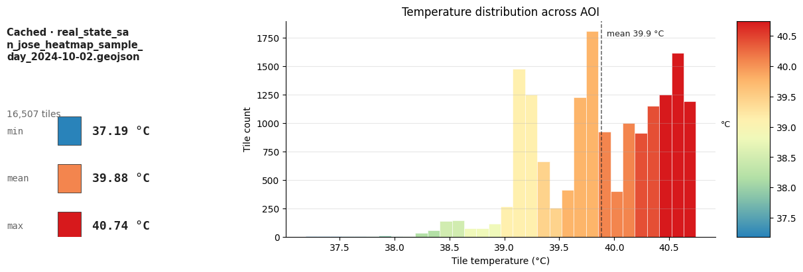
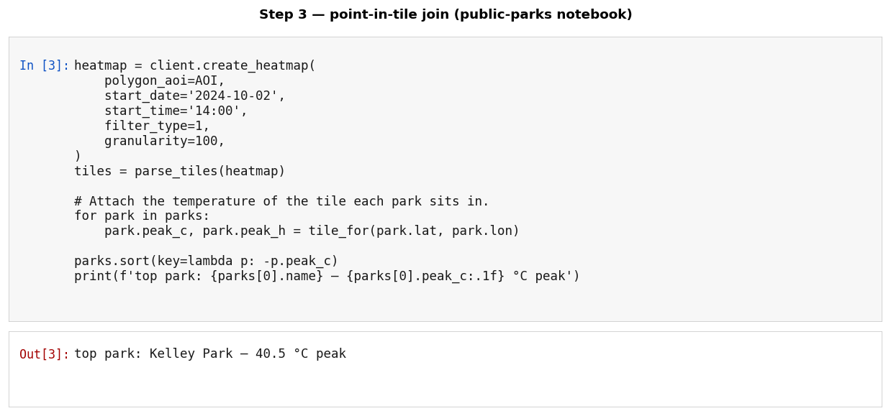

# Use-case notebooks

Narrative workflows that combine **your data** with **FortyGuard's layers** to produce a ranked, defensible action list. The first three follow the same shape — load your point list → join the heatmap → enrich the top exposures with satellite / street-view / env-params → translate the measurements into a business or public-health decision — but differ in inputs, scoring, and outputs so they're not template copies. The last two work from **parcel boundaries** instead and are structured differently; see [The parcel notebooks](#the-parcel-notebooks-different-on-purpose) below.

Run `notebooks/00_setup.ipynb` first if you haven't yet, then pick any of these.

## The five notebooks

| Notebook | Persona / industry | Your data | FortyGuard layers | Output |
|----------|-------------------|-----------|-------------------|--------|
| [Real-estate portfolio heat risk](real_estate_portfolio_heat_risk.ipynb) | Real-estate agents prepping a client portfolio review | Portfolio table (properties + value + sqft) | Heatmap + satellite + street view + env_params | **Client-deck slide pack** — M1/M2/M3 priority maps + per-property action brief with intervention recommendations citing public programs (EPA Heat Island, USDA i-Tree, ASHRAE 90.1, ASHRAE 55, OSHA Heat Illness) + `portfolio_evaluation.csv` |
| [Urban planner — bus-stop cooling](urban_planner_bus_stop_prioritization.ipynb) | City transit / public works | Point layer (bus stops) | Heatmap + satellite + street view + env_params | **Ranked intervention list** with cause-tagged recommendations (pavement vs. canopy vs. ground-level shade) |
| [Public-parks heat-resilience audit](public_parks_heat_resilience_audit.ipynb) | City parks-and-rec / public-health environmental health | Park point list (id + type + acres + lat/lon) | Heatmap + satellite + street view + env_params | **Per-park audit CSV + priority map** with declarative, threshold-triggered recommendations citing federal programs (USDA i-Tree, EPA Heat Island Reduction, CDC BRACE, NRPA Shade-Equity) |
| [Single-parcel heat due diligence](parcel_site_due_diligence.ipynb) | Developers / owners evaluating **one site** before acquisition, entitlement, or design | **One parcel boundary** (single-feature polygon GeoJSON) | **All five** — heatmap (`tcm` + `exceedance` + `persistence`) + satellite + street view + env_params + heat_intelligence | **`reportAll` bundle** — branded PDF + `parcel_evaluation.csv` + `findings.csv` + maps, plus the heat-intelligence narrative alongside |
| [Multi-parcel heat screening](parcel_portfolio_heat_screening.ipynb) | Acquisitions / land teams comparing **several candidate sites** to build a shortlist | **Several parcel boundaries** (multi-feature polygon GeoJSON) | **All five**, with the per-point endpoints spent only on the top `TOP_N` parcels | **Ranked shortlist** — branded PDF + `parcel_screening.csv` + `findings.csv` + maps. Temperatures in **°F with °C in brackets** |

## The parcel notebooks: different on purpose

These are the ones to demo to a client on their own sites. They are not further variations on the point pipeline — the scale forces a different method, and the differences are the interesting part.

| | The three point notebooks | Single parcel | Multi-parcel screening |
|---|---|---|---|
| Input | CSV of points | one polygon boundary | **many polygon boundaries** |
| AOI | citywide, ~104 km² | parcel + 500 m, ~1.2 km² | **hull + 400 m, ~14 km²** |
| Join | point-in-tile lookup | **area-weighted clip** | area-weighted clip, **per parcel** |
| Ranking | points against each other | one site against the **city** | **parcels against each other** |
| Lead metric | peak temperature | **hours above threshold** | **hours above threshold** |
| Enrichment | top-N points | the one site | **top-N parcels** |
| Units | °C | °C | **°F with °C in brackets** |
| Endpoints | 4 | **all 5** | **all 5** |

**Which one to reach for.** Single-parcel answers *"should I buy this site"* — one boundary, everything measured on it. Multi-parcel answers *"which of these should I pursue"* — one shared heatmap request across the whole portfolio (cheaper than one call per site, and it puts every parcel on a common scale), then the expensive per-point endpoints reserved for the top few. Raising `TOP_N` from 3 to 6 doubles that notebook's bill; the heatmap cost does not move.

**Why the join changes.** The heatmap's finest granularity is 60 m, and the sample parcel is 140 × 100 m — under four tiles. A nearest-tile lookup would throw away most of the site and flip its answer depending on where the centroid lands. The notebook instead takes an area-weighted mean over every tile the boundary overlaps.

**Why the lead metric changes.** The daily-peak snapshot spans **0.90 °C** across the single-parcel AOI and **0.94 °C** across the 14 km² portfolio AOI, against **5.85 °C** citywide — below city scale it is nearly flat and cannot separate one site from its neighbours. Exceedance over those same AOIs spans **15.2 h** and **6.5 h** respectively. Duration carries the signal at parcel scale; the snapshot does not.

**A trap worth knowing about.** The `env_params` endpoint applies one `temperature` anchor across all 24 hours and varies only humidity, so `heat_index_celsius` tracks humidity and **peaks overnight**. In the single-parcel run that is 32.5 °C at 02:00 versus 27.3 °C at 14:00, while real air temperature at 02:00 is about 16 °C. On the hot 2026-08-03 screening day it gets extreme: a 37.2 °C anchor with 84% small-hours humidity yields **159 °F / 70 °C at 05:00**, past the end of the NWS table.

It is a humidity-sensitivity curve at a fixed temperature, not a diurnal forecast. Counting "hours above a threshold" from it counts night-time artifacts as daytime exposure. Both parcel notebooks compare against published thresholds only at the **hot hour** (where `apparent_temperature_celsius` peaks) and take all duration figures from the measured `exceedance` layer instead. The multi-parcel notebook additionally scales its chart axis to the meaningful series so the artifact clips off-scale rather than flattening every real curve. **The same caveat applies to the `hours_above_sla` column in the real-estate notebook**, which is computed from this series.

**A second `env_params` limit: it is coarser than your parcels.** The endpoint resolves on a weather grid coarser than parcels within one district are apart. In the bundled screening run, two parcels **1.36 km apart return byte-identical parameter arrays** — same apparent temperature, wet-bulb, humidity, and air quality — because they share a grid cell. The only column that still varies between them is heat index, and it varies *solely* because each parcel supplies its own `temperature` anchor from the heat layer; it is a re-expression of the heatmap, not an independent measurement at that point.

So use the comfort curves to characterise **the district**, not to discriminate between parcels inside it. The multi-parcel notebook hashes each response and prints an explicit warning when two parcels come back identical. Parcel-to-parcel ranking rests on the heatmap layers, which resolve at `GRANULARITY_M` and genuinely do vary per site.

## The shared workflow (point notebooks)

The three point-based notebooks walk through the same five stages — only the input shape and the final action artifact change:

| Stage | What happens | API call |
|---|---|---|
| **1. Load your data** | Read a CSV / GeoJSON of points (properties, stops, parks). The only required columns are `id`, `name`, `latitude`, `longitude`. | — |
| **2. Heat layer** | One 24-hour heatmap over the AOI. Each tile carries hourly temperatures `'00'..'23'`. | `client.create_heatmap(...)` |
| **3. Per-point join** | For every point in your data, find the heatmap tile it sits in and copy off peak temp, peak hour, and hours-above-NOAA-Caution. Now your table is heat-aware. | (none — local point-in-tile lookup) |
| **4. Diagnose the top-N hottest** | The hottest points get the deeper look: satellite for surface composition (canopy / impervious), street-view at #1 for ground-level shade, env-params for the heat-index curve. | `client.satellite_segmentation(...)`, `client.street_view_segmentation(...)`, `client.environmental_parameters(...)` |
| **5. Action artifact** | Translate the measurements into the output your audience actually uses — a client-deck slide pack, a ranked intervention list, or a tiered audit CSV with measurement-triggered recommendations. | — |

```text
┌─ your CSV ─┐    ┌─ heatmap ─┐    ┌─ diagnose top-N ─┐    ┌─ action ─┐
│ id, lat,   │ →  │ tiles ×   │ →  │ satellite +      │ →  │ ranked   │
│ lon, …     │    │ 24 hours  │    │ street-view +    │    │ list /   │
│            │    │           │    │ env-params       │    │ slides   │
└────────────┘    └───────────┘    └──────────────────┘    └──────────┘
```

## What you'll see when you run them

After loading the heatmap each notebook renders a one-line AOI summary card (min / mean / max swatches + colored histogram + colorbar) so you can eyeball the temperature distribution before any per-point logic runs:



The heatmap itself can be visualized as a tile-by-tile map. Below: the bundled San Jose sample heatmap, side-by-side at daily mean and daily peak — you can see the urban heat island concentrated in the south-east portion of the AOI, exactly the kind of pattern the per-point join in Step 3 will pick up:


The deep-dive on the top-N hottest items always includes a satellite-segmentation stacked bar — this is what tells the user *why* each top item is hot (high impervious / low canopy → tree-planting candidate; high tree % already → look at heat-index instead):


A representative cell from the public-parks notebook — Step 3 joins each park to the tile it sits in and ranks by peak temperature. Every notebook follows the same shape:



## Three output styles

The three notebooks share the same pipeline shape but produce different *kinds* of artifact so you can see how the same FortyGuard data maps onto different audiences:

- **Real estate** — a **client-meeting slide pack** (three priority maps + per-property action brief). The agent walks into a client review with M1/M2/M3 ready to present and a one-paragraph recommendation per top property tied to a public intervention program.
- **Bus stops** — a single **ranked intervention list** with cause tagging (pavement, canopy, or ground-level shade) so the city public-works team knows which kind of intervention each stop needs.
- **Public parks** — **declarative, threshold-triggered recommendations** with no invented index and no monetary translation. Every action is *if measurement X crosses a published threshold Y, recommend program Z*, where the threshold and the program both already exist (NOAA, EPA, USDA, CDC, NRPA). Portable to any city in the country.

## Running the use cases

**The two parcel notebooks run with no API key.** Their inputs *and* their cached API responses ship with the repo, so on a fresh clone you can open either one, Run All, and get the complete output bundle without a key and without spending credits. They use a single `cached_or_live()` helper: it reads the cached response if present, otherwise calls the API and caches it. Set `REFRESH = True` in the Setup cell — or change `STUDY_DATE`, `GRANULARITY_M`, `BUFFER_M`, or the date window, which all change the cache filenames — to force fresh, billable calls.

**The three point notebooks need a key and your own data.** The rest of `data/` is git-ignored and not shipped, so bring your own input CSV (each notebook's Setup section documents the expected columns and path). They split each API step into paired `Step Na` (live) / `Step Nb` (cached) cells — run whichever you want, and save responses under `data/` to replay offline later.

One caveat on the offline path: `parcel_site_due_diligence.ipynb` computes an optional **citywide percentile** from `data/heatmaps/heatmap_san_jose_2024-07-15_live.geojson`, a 6.8 MB citywide capture that is *not* shipped. Without it that one statistic is skipped and the notebook prints a note; everything else runs normally. Run any of the three point notebooks once to generate it.

## Coverage and date range

- **U.S. only.** The FortyGuard API serves data for locations inside the United States. Use cases run end-to-end here for San Jose, CA; swap in any U.S. AOI and the workflows hold. Coordinates outside the U.S. will return errors or empty responses.
- **Dates: 2021 to today.** `STUDY_DATE` must be on or after `2021-01-01` (the catalog's start) and no later than today — earlier or future dates fail at the heatmap call with a "no data available" error. The sample dates are `2024-07-15` (bus-stops) and `2024-10-02` (parks, real-estate); change `STUDY_DATE` in the Setup cell to re-run for any other valid day.

## Why env-params is only run on the top-N hottest

The env-params API needs a per-point `temperature` value — the ambient air temperature at that lat/lon, in °C (see [`notebooks/02_environmental_parameters.ipynb`](../02_environmental_parameters.ipynb) for the field-level explanation). The API uses that anchor to derive heat index, apparent temperature, wet-bulb, etc., so the response is meaningful only when the anchor reflects real conditions.

In every use-case notebook the heatmap (Step 2) already produces a peak temperature for every input point. The notebooks pass each of the **top-N hottest** points' `peak_temp_c` straight into the env-params `temperature=` argument, then let the API derive the diurnal heat-index / wet-bulb / humidity curves for those points. Two reasons we limit it to the top-N rather than every point:

- **Credit budget.** env-params is a per-point call; running it across an entire portfolio would burn credits on locations that are already known not to be hot.
- **Decision relevance.** Every downstream recommendation (Step 9 / 10) is about how to intervene at the hottest points — the comfort metrics only need to be defensible *there*. Running env-params on a temperate point would produce numbers no decision depends on.

## Output folder structure

Each notebook writes its hand-off bundle to a per-run folder under `outputs/`:

```
outputs/
  bus_stops_<STUDY_DATE>/
    action_list.csv              # ranked intervention list (Step 9)
    bus_stops_report.pdf         # multi-page PDF for slide decks
    maps/*.html                  # standalone interactive folium maps
  public_parks_<STUDY_DATE>/
    parks_audit.csv              # per-park audit + threshold-triggered recs
    parks_report.pdf             # multi-page PDF
    maps/*.html
  real_estate_<STUDY_DATE>/
    portfolio_evaluation.csv     # per-property scoring + tiers
    real_estate_report.pdf       # client-deck slide pack
    maps/*.html
  parcel_<slug>_<STUDY_DATE>/
    parcel_due_diligence_report.pdf       # the client deliverable
    parcel_evaluation.csv                 # every measured value, one row
    findings.csv                          # threshold / measurement / verdict / program
    heat_intelligence_<slug>_<date>.pdf   # narrative companion
    maps/*.html
  parcel_portfolio_<city>_<STUDY_DATE>/
    parcel_screening_report.pdf           # ranked committee pack
    parcel_screening.csv                  # one row per parcel, °F and °C columns
    findings.csv                          # per-parcel, with an explicit `adverse` flag
    heat_intelligence_<lead_parcel>_<date>.pdf
    maps/*.html
```

The exact filenames may differ slightly between notebooks, but the shape is the same: a CSV the operations team can open in Excel, a PDF for stakeholder packets, and standalone HTML maps for design review. `outputs/` is git-ignored, so nothing here ships with the repo — every run produces its own bundle.

## Extending

Each notebook ends with an "Apply this pattern" section listing adjacent use cases that reuse the same pipeline with different inputs.
